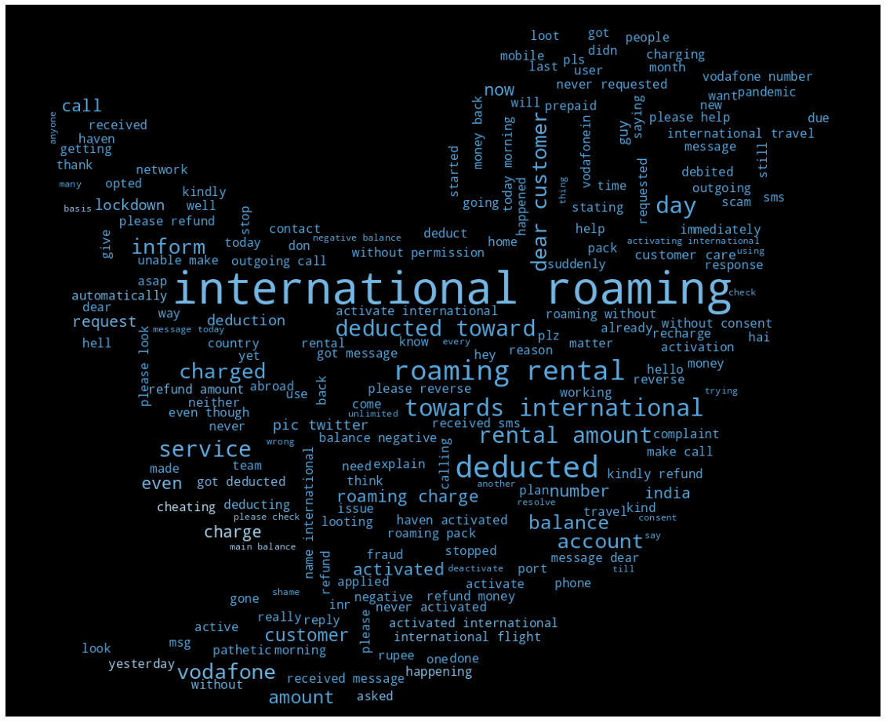

# customer-reviews

Project Steps:
- Importing the required libraries
- Loading the Dataset based on customer
- feedback
- Exploring textual data
- Using regex
- Cleaning textual data
- Tokenization
- Transforming unstructured data to structured data
- Vectorizer - choosing between TDIDF and count vectorizer
- Unsupervised Machine Learning
- Understanding Kmeans
- Clustering tweets
- Identifying the optimal number of clusters
- Homogeneity of data
- Visualizing with word clouds
- Labeling data

The KMeans cluster is used to classify this project based on unstructured customer complaint data. This research has received the most input on foreign roaming issues, some of which are calling problems and others billing problems. Individuals may take initiative to address their difficulties with ease after gaining access to these solution patterns. Based on client feedback, this model will be useful for analyzing various industries, such as the health industry, finance sector, and food business.

